<center>
 
 # Отчёт по курсу 'Введение в Linux'

 # **Вахиш Дуаа Иссам Али Ахмед**

</center>

<div style="page-break-before:always"></div>

# Цель работы
Закрепить практические навыки работы в Linux, выполнив все тесты и задания курса на Stepik.

# Задание
Пройти курс, оформить отчёт со скриншотами вопросов, правильных ответов и краткими пояснениями.

<div style="page-break-before:always"></div>

# Выполнение

# первая часть курса : введение 

<center>


## 1. Общая информация о курсе


</center>

<div style="page-break-before:always"></div>

### Вопрос 1: Как называется этот курс?
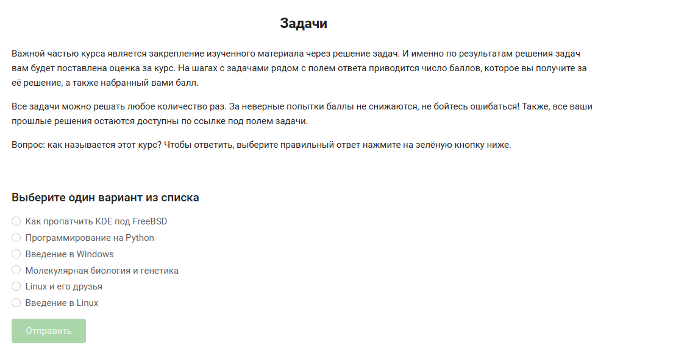
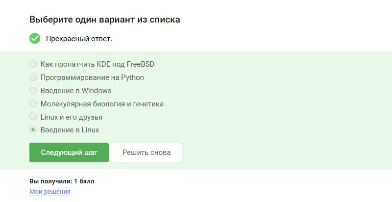

**Пояснение:**  
Курс называется **«Введение в Linux»**. Остальные варианты не имеют отношения к курсу.

<div style="page-break-before:always"></div>

### Вопрос 2: Отметьте все верные утверждения
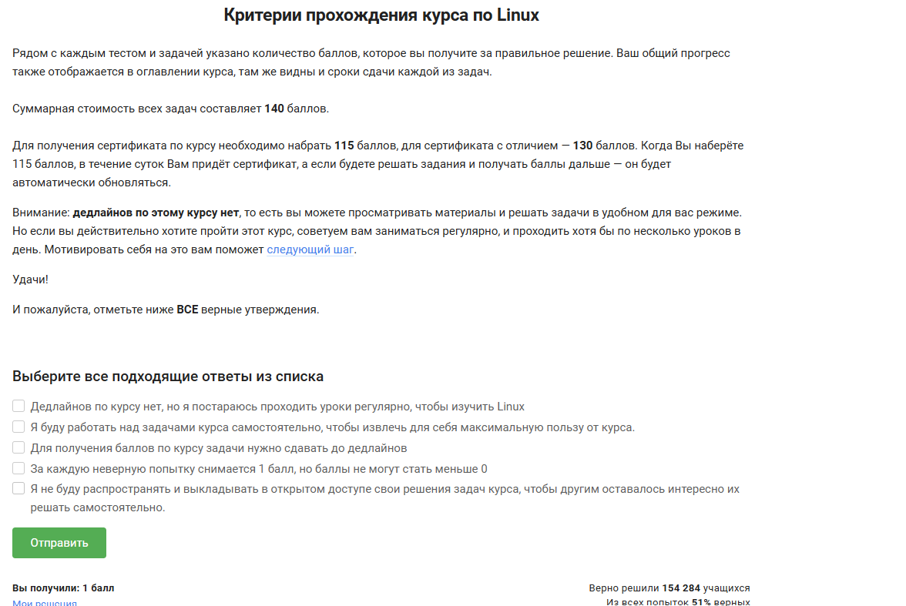
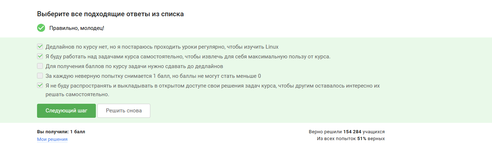

**Пояснение:**  
Верные утверждения: работать самостоятельно, не выкладывать решения, дедлайнов нет.

<div style="page-break-before:always"></div>

<center>


## 2. Как установить Linux

</center>

<div style="page-break-before:always"></div>

### Вопрос 3: Какую ОС вы обычно используете?
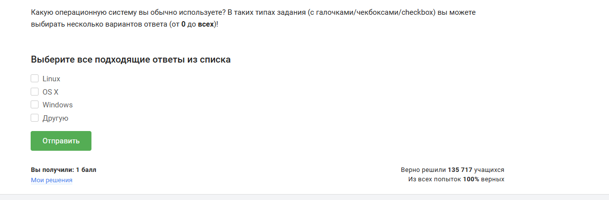
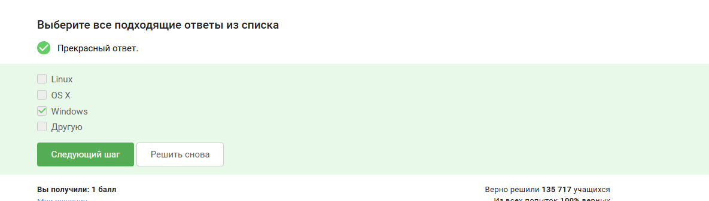

**Пояснение:**  
Использую Windows (основная) 

<div style="page-break-before:always"></div>

### Вопрос 4: Что такое виртуальная машина?
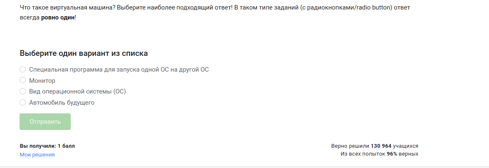


**Пояснение:**  
Виртуальная машина — программа для запуска одной ОС внутри другой.

<div style="page-break-before:always"></div>

### Вопрос 5: Смогли ли вы запустить Linux?


**Пояснение:**  
Да, установила Fedora на VirtualBox и запустила.

<div style="page-break-before:always"></div>

<center>


## 3. Осваиваем Linux

</center>

<div style="page-break-before:always"></div>

### Задание 6: Создать документ «Hello, Linux!» (FODT/XML)
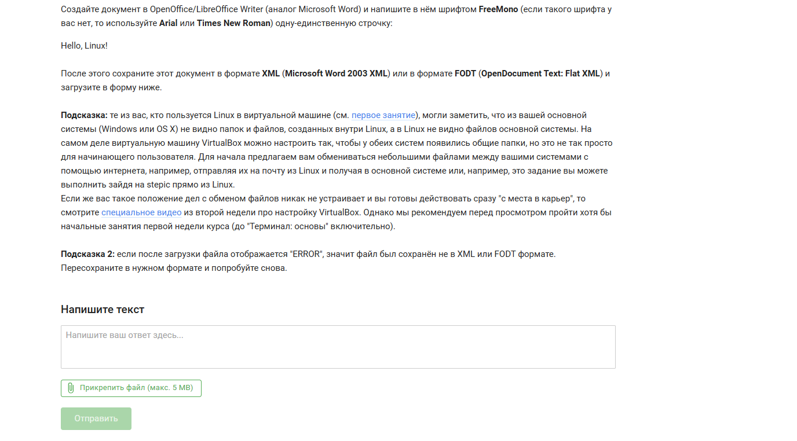
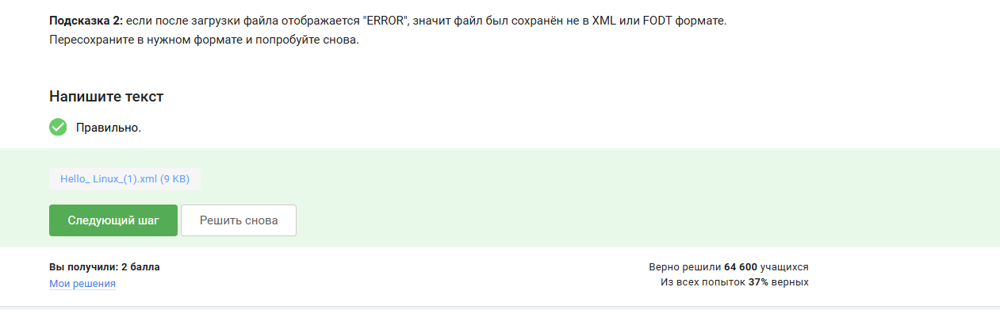

*Пояснение выполнения:**  
1. **Создание документа:** Открыла LibreOffice Writer (текстовый процессор).  
2. **Набор текста:** Напечатала строку `Hello, Linux!` точно по заданию.  
3. **Выбор шрифта:** В задании требовался шрифт `FreeMono`. Если бы его не было, можно использовать `Arial` или `Times New Roman` как допустимую замену.  
4. **Сохранение в нужном формате:** Нажала «Файл» → «Сохранить как». В поле «Тип файла» выбрала `FODT (OpenDocument Text, Flat XML)` — один из двух разрешённых форматов (второй — Microsoft Word 2003 XML). Назвала файл `hello.fodt`.  
5. **Загрузка на Stepik:** На странице задания нажала «Прикрепить файл», выбрала скачанный `hello.fodt` и нажала «Отправить».  

<div style="page-break-before:always"></div>

### Вопрос 7: Расширение установочных пакетов в Ubuntu?
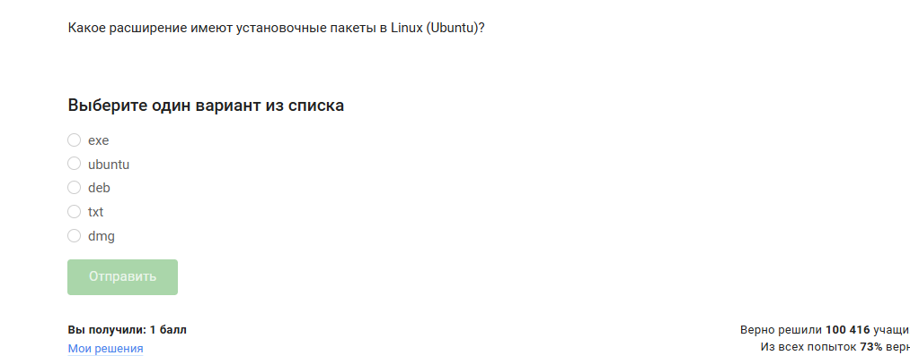
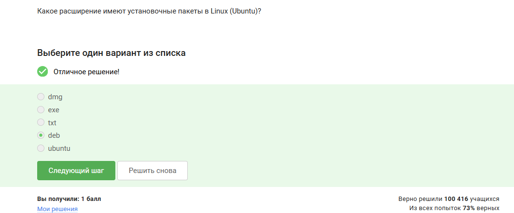

**Пояснение:**  
В дистрибутивах Linux на основе Debian (включая Ubuntu) установочные пакеты имеют расширение **`.deb`**.  
- `exe` — для Windows.  
- `dmg` — для macOS.  
- `txt` — текстовый файл.  
- `ubuntu` — не расширение, а название дистрибутива.  
Таким образом, правильный ответ — `deb`.

<div style="page-break-before:always"></div>

### Задание 8: Установка VLC и поиск фамилии из вкладки Authors
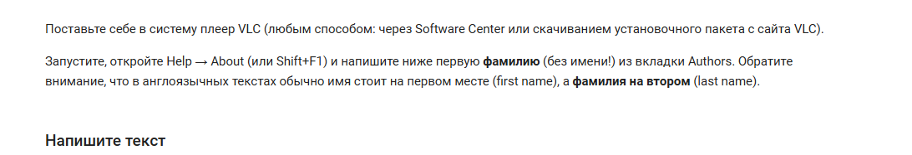
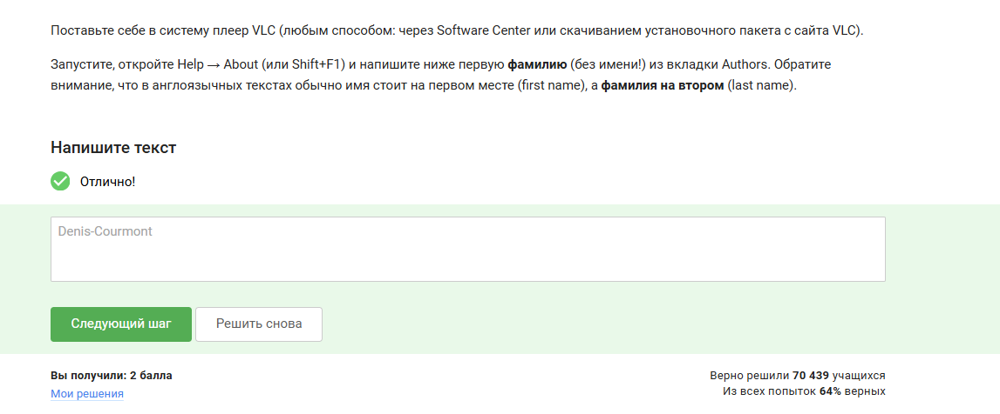

**Пояснение выполнения:**  
1. **Установка VLC:** В терминале Fedora выполнила команду `sudo dnf install vlc` (так как Fedora использует пакетный менеджер `dnf`).  
2. **Запуск VLC:** После установки открыла программу.  
3. **Открытие информации:** Перешла в меню `Help` → `About` (или нажала `Shift+F1`).  
4. **Вкладка Authors:** В открывшемся окне выбрала вкладку **`Authors`**. Первое имя в списке — `Rémi Denis-Courmont`. В английской записи сначала идёт имя (Rémi), затем фамилия (Denis-Courmont).  
5. **Ответ:** Скопировала фамилию `Denis-Courmont` и вставила в поле ответа на Stepik.  
<div style="page-break-before:always"></div>

### Вопрос 9: Для чего нужен Update Manager?


**Пояснение:**  
Update Manager (менеджер обновлений) в данном тесте выполняет три функции:
 обновление всей системы, обновление установленных программ, а также обновление ссылок в Software Center.

<div style="page-break-before:always"></div>

### Вопрос 10: Синонимы для «командной строки»


**Пояснение:**  
В Linux «командная строка» имеет несколько синонимов: **«Терминал»** (Terminal) и **«Консоль»** (Console).  
«Ассоль» — персонаж книги, «Термин» — слово, не относящееся к интерфейсу. Поэтому правильные ответы — «Терминал» и «Консоль».

<div style="page-break-before:always"></div>

<center>


## 4. Terminal: основы

</center>

<div style="page-break-before:always"></div>

### Вопрос 11: Команды, эквивалентные `ls -A --human-readable -l /some/directory`
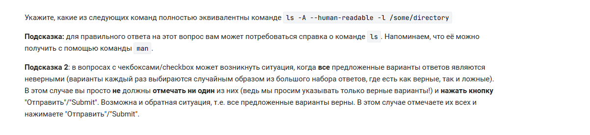
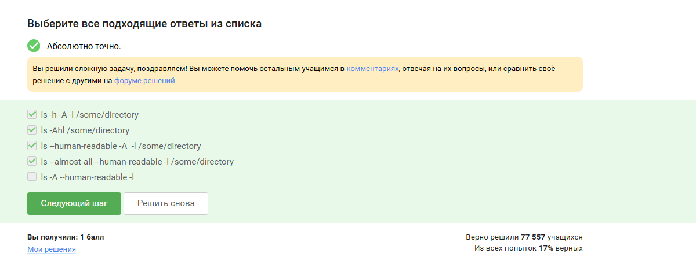

**Пояснение:**  
Эквивалентность означает, что команда выполняет то же действие с теми же опциями.  
- `-A` = `--almost-all` (показывать все файлы, кроме `.` и `..`).  
- `--human-readable` = `-h` (отображать размеры в удобном формате, например, 1K, 2M).  
- `-l` — длинный формат вывода (права доступа, владелец, размер, дата).  
- `/some/directory` — целевая директория. 
- Правильные команды — те, которые содержат **эти же опции и путь** в любом порядке. Все предложенные варианты (кроме последнего, где отсутствует путь) подходят:  
- `ls -h -A -l /some/directory`   
- `ls -Ahl /some/directory`  (опции объединены в одну)  
- `ls -human-readable -A -l /some/directory`  (длинные опции)  
- `ls -almost-all -human-readable -l /some/directory` 
- `ls -A -human-readable -l`  (нет пути `/some/directory`, поэтому не эквивалентна).  

<div style="page-break-before:always"></div>

### Вопрос 12: Вывести содержимое `/home/bi/Downloads` из `/home/bi/Documents`
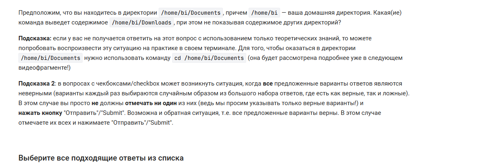


**Пояснение:**  
Из директории `/home/bi/Documents`:  
- `ls ../Downloads` — `..` поднимается на уровень выше (в `/home/bi`), затем переходит в папку `Downloads`.   
- `ls ~/Downloads` — символ `~` заменяется на домашнюю директорию `/home/bi`.  
- `ls ./Downloads` — неверно, так как внутри `Documents` нет подкаталога `Downloads`.  
- `ls /home/bi/Do*` — неверно, так как маска `Do*` найдёт и `Documents`, и `Downloads` (оба начинаются с `Do`), а нужно только содержимое `Downloads`.

<div style="page-break-before:always"></div>

### Вопрос 13: Команда для удаления директорий

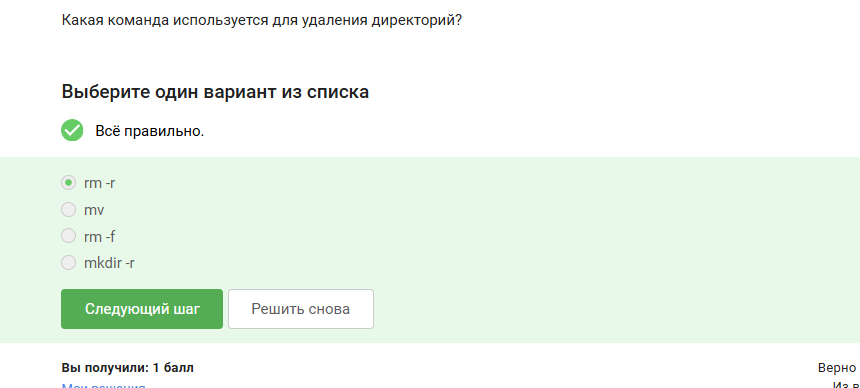

**Пояснение:**  
- `rm -r` (рекурсивное удаление) — удаляет директорию вместе со всем её содержимым. Это правильный ответ.  
- `rm -f` — удаляет файлы без подтверждения, но не работает с директориями.  
- `mv` — перемещает/переименовывает.  
- `mkdir -r` — такой опции нет (правильно `mkdir -p` для создания родительских директорий).


<div style="page-break-before:always"></div>

<center>


## 5. Запуск исполняемых файлов

</center>

<div style="page-break-before:always"></div>

### Вопрос 14: Что будет после `firefox`, затем `exit`?
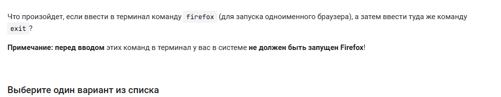
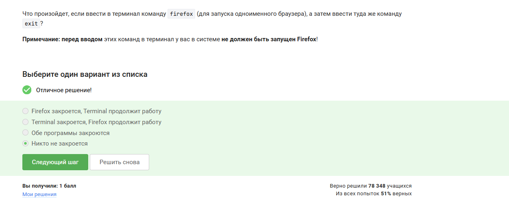

**Пояснение:**  
Когда мы запускаем `firefox` из терминала, терминал переходит в режим ожидания, пока Firefox не закроется. Если затем ввести команду `exit` (которая завершает текущий сеанс терминала), то терминал закроется, а Firefox продолжит работать как отдельный процесс.  
Таким образом, результат: **Terminal закроется, Firefox продолжит работу**.

<div style="page-break-before:always"></div>

### Вопрос 15: Чему эквивалентен запуск с `&`?

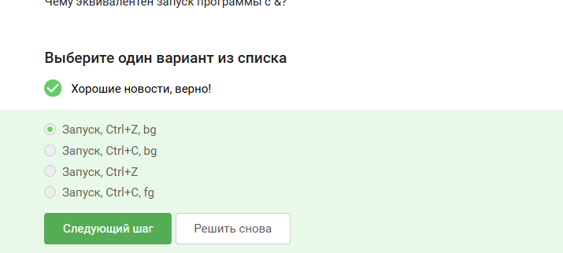

**Пояснение:**  
Символ `&` в конце команды запускает программу в **фоновом режиме**, освобождая терминал для других команд.  
Того же эффекта можно достичь вручную:  
1. Запустить программу обычным способом (она займёт терминал).  
2. Приостановить её нажатием `Ctrl+Z`.  
3. Отправить её в фон командой `bg`.  
Таким образом, эквивалентная последовательность: **Запуск, Ctrl+Z, bg**.

<div style="page-break-before:always"></div>

### Задание 16: Скачать файл, сделать исполняемым, запустить, скопировать вывод
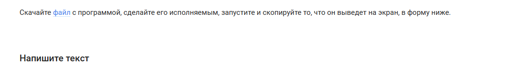
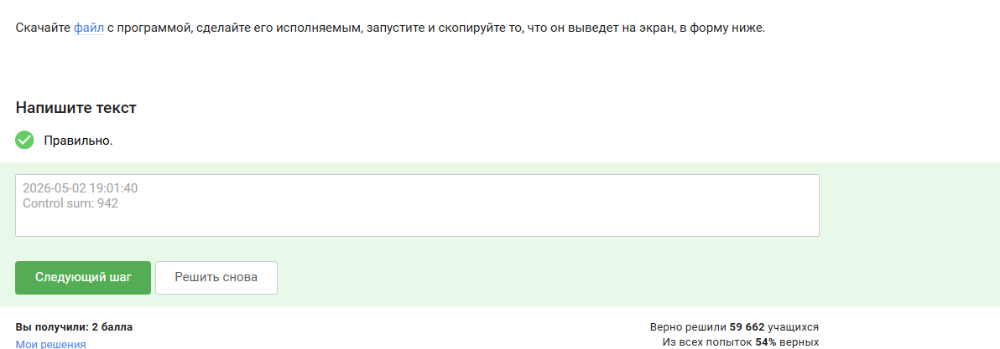

**Пояснение выполнения:**  
1. Перешла в каталог `~/Downloads`.  
2. Скачала файл `lec1_frag4_current_time.py` с помощью браузера (или `wget`).  
3. Сделала файл исполняемым: `chmod +x lec1_frag4_current_time.py` (добавляет право на выполнение).  
4. Запустила: `./lec1_frag4_current_time.py`.  
5. На экране появился вывод:
6. Скопировала этот вывод и вставила в форму ответа на Stepik.  

<div style="page-break-before:always"></div>


<center>


## 6. Ввод / вывод

</center>

<div style="page-break-before:always"></div>

### Вопрос 17: Куда выводится stderr по умолчанию?

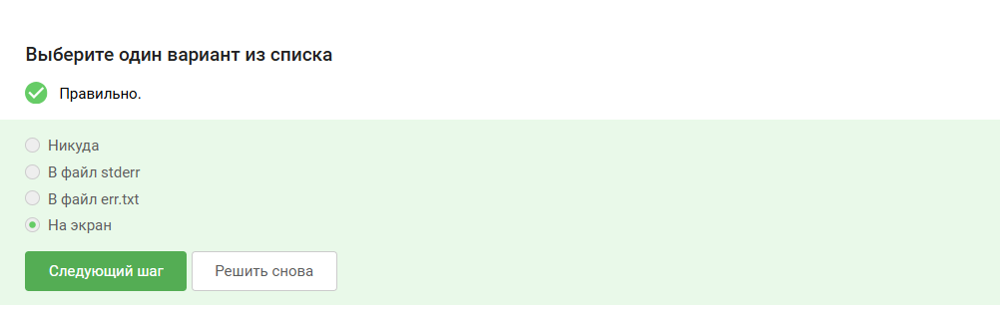

**Пояснение:**  
На экран.

<div style="page-break-before:always"></div>

### Вопрос 18: Какие команды запишут stderr в `file.txt`?

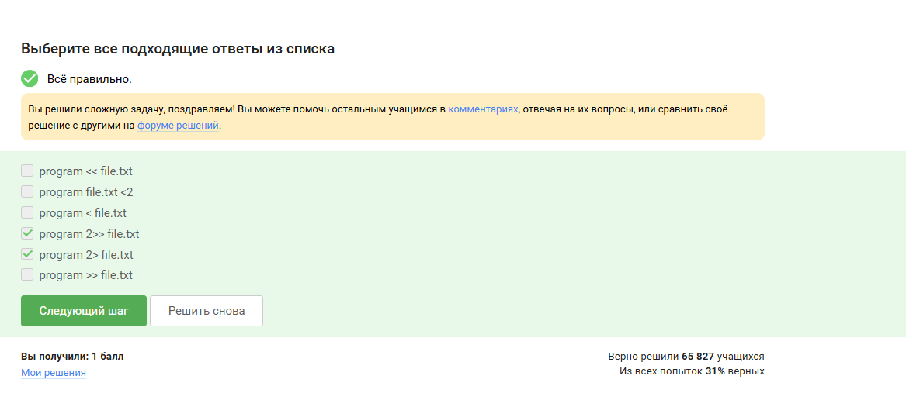

**Пояснение:**  
Для перенаправления потока ошибок (stderr) используется конструкция `2>`.  
- `program 2> file.txt` — перенаправляет stderr в файл, перезаписывая его содержимое.  
- `program 2>> file.txt` — перенаправляет stderr в файл, добавляя данные в конец.  
Остальные варианты:  
- `program >> file.txt` — перенаправляет stdout (не stderr).  
- `program < file.txt` — перенаправляет ввод.  
- `program file.txt <2` — неверный синтаксис.
- 
  <div style="page-break-before:always"></div>

### Вопрос 19: Куда девается stderr в конвейере (pipe)?

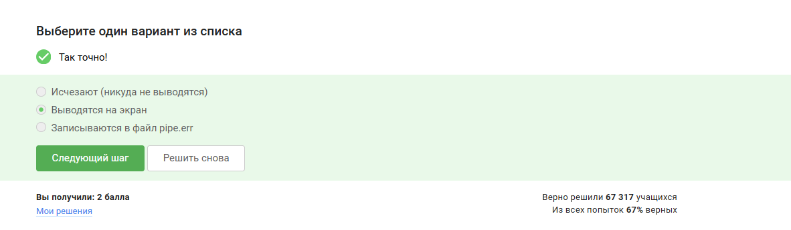

**Пояснение:**  
Выводится на экран.

<div style="page-break-before:always"></div>

<center>


## 7. Скачивание файлов из интернета

</center>

<div style="page-break-before:always"></div>

### Вопрос 20: Где окажется картинка после `wget -P /home/alex/Pictures -O 1.jpg ...`?
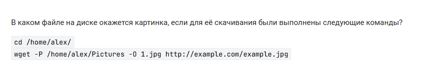


**Пояснение:**  
Команда `wget` имеет опции:  
- `-P /home/alex/Pictures` — задаёт **каталог**, в который будет сохранён файл.  
- `-O 1.jpg` — задаёт **имя** выходного файла.  
Таким образом, изображение будет сохранено как `/home/alex/Pictures/1.jpg`.  
Исходное имя (`example.jpg`) игнорируется.

<div style="page-break-before:always"></div>

### Вопрос 21: Опция `wget` для подавления сообщений
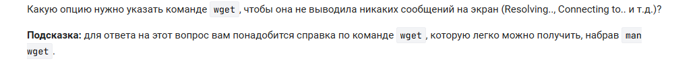
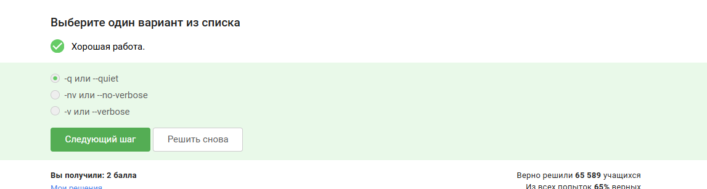
**Пояснение:**  
Опция **`-q`** (или `--quiet`) включает тихий режим, при котором `wget` не выводит никаких сообщений (Resolving..., Connecting..., HTTP-запросы, прогресс-бар).  
- `-nv` (no-verbose) — отключает детальный вывод, но некоторые сообщения всё же показываются.  
- `-v` (verbose) — наоборот, включает подробный вывод.
  
<div style="page-break-before:always"></div>

### Вопрос 22: Что скачает `wget -r -l 1 -A jpg`?


**Пояснение:**  
- `-r` — рекурсивная загрузка (следует по ссылкам).  
- `-l 1` — глубина рекурсии 1 (загружается только указанная страница и прямые ссылки с неё).  
- `-A jpg` — принимает только файлы с расширением `.jpg`.  

В результате `wget` загрузит HTML-страницы для навигации (чтобы найти ссылки на изображения), но **сохранит только файлы `.jpg`**. Остальные файлы (`.png`, `.html`) не сохраняются.

<div style="page-break-before:always"></div>


## 8. Работа с архивами

<div style="page-break-before:always"></div>

### Вопрос 23: Отличие gzip от zip (по умолчанию)


**Пояснение:**  
При сжатии без дополнительных опций:  
- **`gzip`** сжимает один файл и **удаляет исходный** (остаётся только `.gz`-архив).  
- **`zip`** сжимает файл(ы) и **сохраняет исходные** файлы (добавляет `.zip`-архив рядом).  
Это основное различие в поведении по умолчанию.

<div style="page-break-before:always"></div>

### Вопрос 24: Какие архиваторы могут создать архив из директории?


**Пояснение:**  
- **`zip`** может упаковывать целые директории рекурсивно (например, `zip -r archive.zip mydir/`).  
- **`tar`** предназначен именно для создания архивов из директорий (например, `tar -cf archive.tar mydir/`).  
- **`gzip`** работает только с отдельными файлами; для директории его нужно комбинировать с `tar` (получается `tar.gz`). Поэтому правильные ответы — `zip` и `tar`.


<div style="page-break-before:always"></div>

### Вопрос 25: Опции `tar` для `my_archive.tar.bz2`
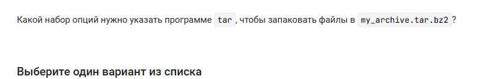
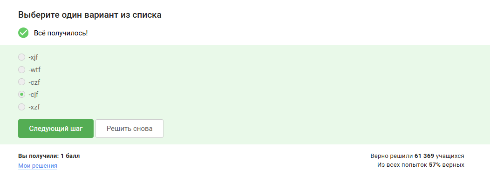

**Пояснение:**  
Опции `tar`:  
- `-c` — создать архив (create).  
- `-j` — использовать сжатие **bzip2** (расширение `.bz2`).  
- `-f` — указать имя файла.  

Таким образом, правильный набор: **`-cjf`**.  
- `-czf` — использовало бы сжатие gzip (`.gz`).  
- `-xjf` — распаковывает (x), а не создаёт.  
- `-xzf` — распаковывает gzip.  
- `-wtf` — неверные опции.

<div style="page-break-before:always"></div>

<center>


## 9. Поиск файлов и слов

</center>

<div style="page-break-before:always"></div>

### Вопрос 26: Какая маска `find` НЕ найдёт `Alexey.jpeg`?

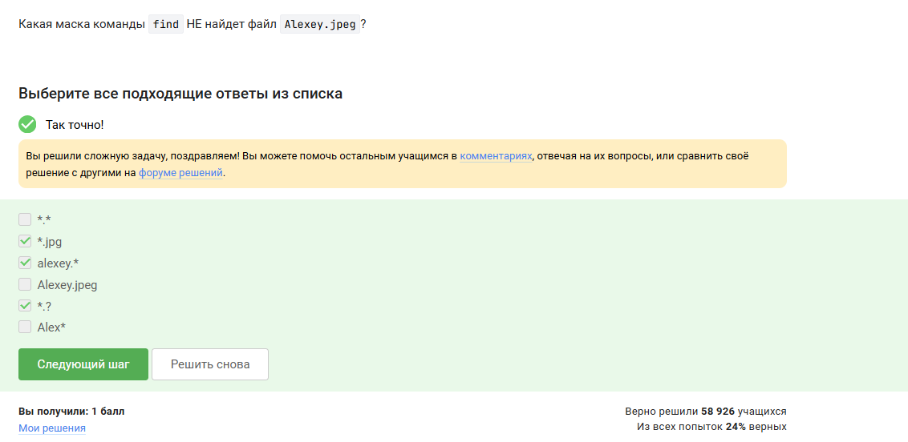

**Пояснение:**  
`*.jpg`, `alexey.*`, `*.?`.

<div style="page-break-before:always"></div>

### Вопрос 27: Какие строки выведет `grep "world" text.txt`?
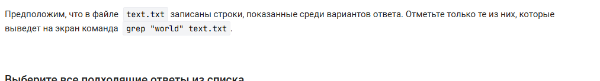
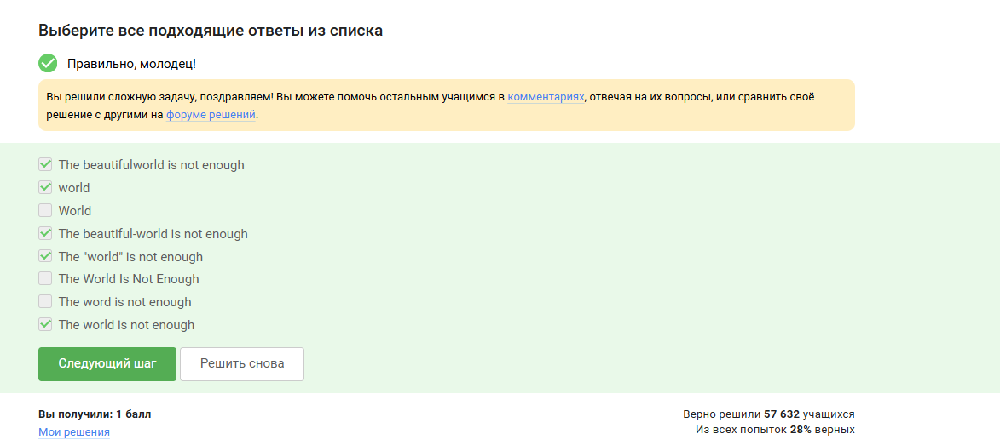

**Пояснение:**  
`grep "world"` (без `-i`) ищет точное совпадение **с учётом регистра** (строчные буквы).  
Выведутся строки, содержащие слово `world` именно в таком виде:  
- `The beautiful world is not enough` 
- `world`   
- `The "world" is not enough`  (кавычки не влияют)  
- `The world is not enough` 
   
<div style="page-break-before:always"></div>

### Задание 28: Архив Шекспира — найти строки с "love"
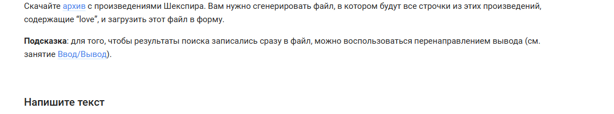
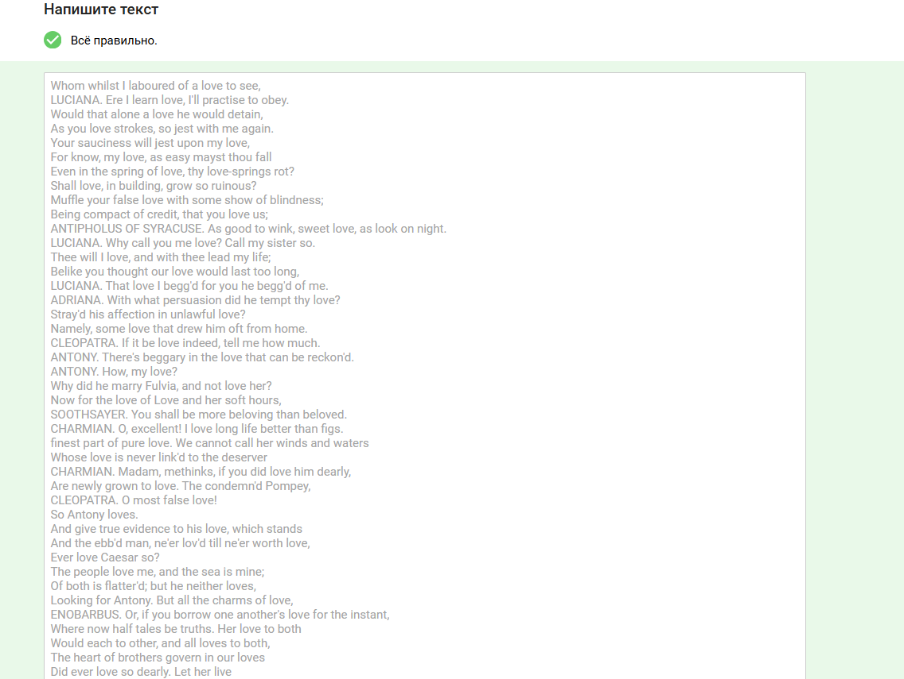

**Пояснение выполнения:**  
1. Скачала архив (например, `shakespeare(2).zip`) и распаковала его в каталог `~/Downloads/shakespeare(2)/Shakespeare`.  
2. Перешла в этот каталог: `cd ~/Downloads/shakespeare(2)/Shakespeare`.  
3. Выполнила команду для поиска всех строк, содержащих `love` (без учёта регистра), во всех текстовых файлах, и сохранила результат в `love_lines.txt`:  
   ```bash
   grep -r -i "love" --include="*.txt" . > love_lines.txt

<div style="page-break-before:always"></div>

# Вывод
Все задания курса выполнены. Получены практические навыки работы в Linux.


